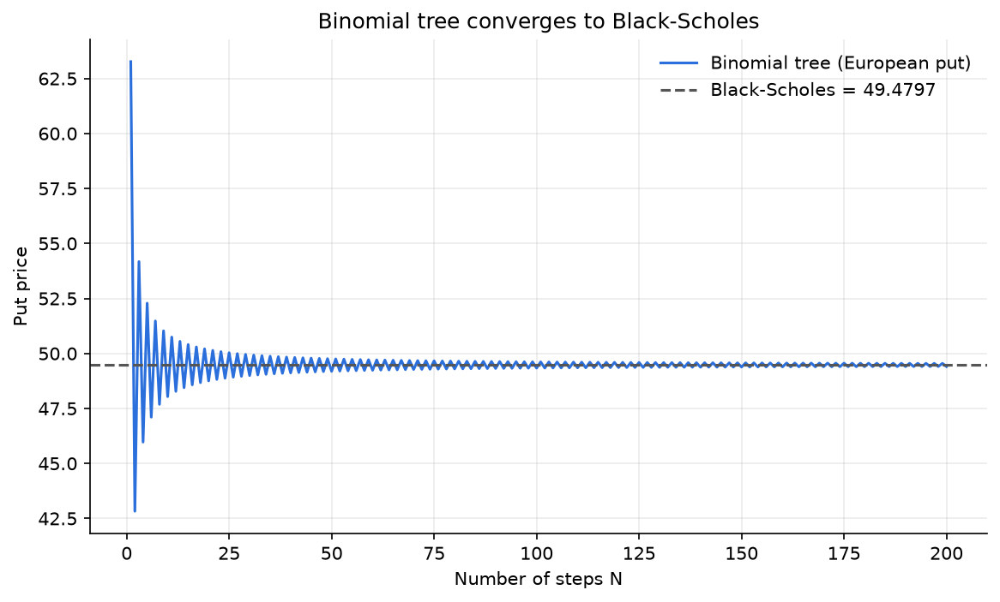
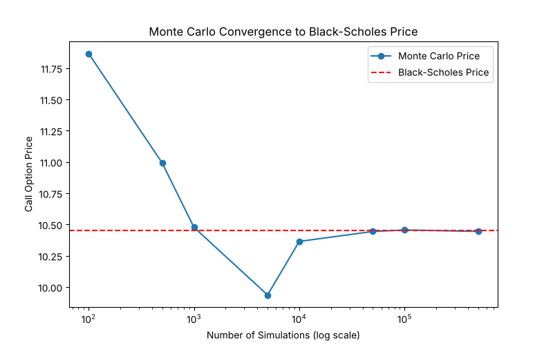
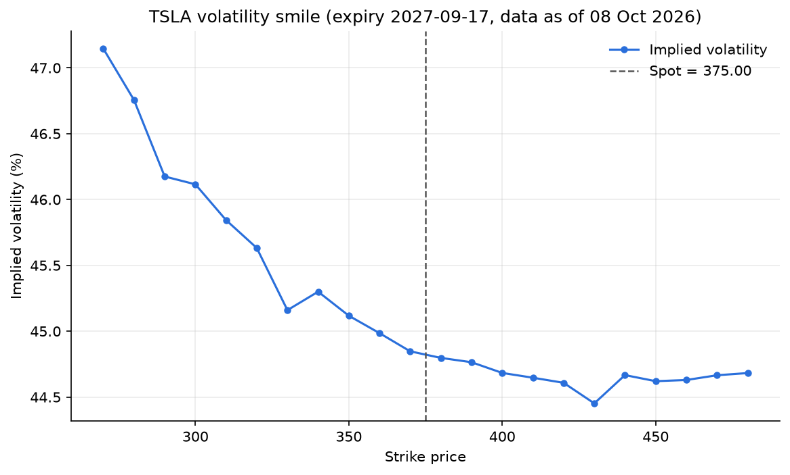

# Options Pricer

Python implementation of European and American option pricing using Black-Scholes, Monte Carlo simulation and a binomial tree, with Greeks, implied volatility and a volatility smile built from live market data.

## Features

- **Black-Scholes** closed-form pricing for European calls and puts, with put-call parity checks
- **Greeks** (Delta, Gamma, Vega, Theta), each computed analytically and by finite differences
- **Monte Carlo** pricing under risk-neutral geometric Brownian motion, with convergence analysis and path simulation
- **Binomial tree** (Cox-Ross-Rubinstein) for European and American options
- **Implied volatility** solver (Newton-Raphson) and a **volatility smile** from live option chains (via `yfinance`)
- **pytest suite**: known values, put-call parity, Greeks vs finite differences, convergence, and no-arbitrage properties (e.g. American call = European call without dividends)

## Results

### 1. Benchmark: all methods agree
S = 100, K = 100, T = 1 year, r = 5%, σ = 20%

| Method | Call | Put |
|---|---|---|
| Black-Scholes | 10.4506 | 5.5735 |
| Binomial tree (N = 1000) | 10.4486 | 5.5715 |
| Monte Carlo (500,000 sims) | 10.44 | 5.57 |
| Binomial tree, American | 10.4486 | 6.0896 |

The American put is worth more than the European put because early exercise has value for puts. The American call equals the European call, since early exercise is never optimal for a call on a non-dividend stock.




DData from the 8 Oct 2026 close, expiry 17 Sep 2027. S = 375.00, K = 370 (at the money), T = 0.94, r = 5%, σ = 44.9% (implied from the market price of the at-the-money call).

| Method | Call | Put |
|---|---|---|
| Black-Scholes | 74.23 | 52.29 |
| Binomial tree (N = 1000) | 74.24 | 52.31 |
| Monte Carlo (500,000 sims) | 74.28 | 52.30 |
| Binomial tree, American | 74.24 | 54.01 |

The Black-Scholes call matches the market mid price (74.225) by construction, since σ was solved from it. The table validates that the three methods agree on a realistic option.

### 3. Volatility smile
Implied volatility across strikes is not constant: about 47.2% at the lowest strike (270), falling to about 44.9% at the spot and roughly 44.5% to 44.8% above it. Black-Scholes assumes one volatility for all strikes, so this is direct evidence against that assumption.

The Black-Scholes call matches the market mid price (74.225) by construction, since σ was solved from it. The table validates that the three methods agree on a realistic option.

### 3. Volatility smile
Implied volatility across strikes is not constant: about 47.2% at the lowest strike (270), falling to about 44.9% at the spot and roughly 44.5% to 44.8% above it. Black-Scholes assumes one volatility for all strikes, so this is direct evidence against that assumption.
The Black-Scholes call matches the market mid price (72.72) by construction, since σ was solved from it. The table validates that the three methods agree on a realistic option.

### 3. Volatility smile
Implied volatility across strikes is not constant: about 46.7% at low strikes, falling to about 44.5% near the spot, and roughly flat above. Black-Scholes assumes one volatility for all strikes, so this is direct evidence against that assumption.



## Design notes

- **Mid price, not last price.** Implied volatility uses (bid + ask) / 2, since the last trade can be stale for illiquid options.
- **Long-dated expiry.** Very short-dated options make Vega close to zero, which destabilises Newton-Raphson. The demo uses the expiry closest to one year.
- **Two methods per Greek.** Analytical formulas are checked against finite differences.
- **Tree convergence.** The tree price oscillates around the Black-Scholes value for odd and even N and converges as N grows.

## Limitations

- **Constant volatility** is contradicted by the smile.
- **Lognormal returns** understate the fat tails seen in real markets.
- **No dividends** are modelled.
- **Black-Scholes is European-only.** Listed US equity options are American, so for puts Black-Scholes slightly underprices; the tree handles this.
- **A single flat risk-free rate** (5%) is used rather than a term structure.

## Project structure

```
options-pricer/
├── src/        # pricing models, Greeks, implied vol, smile, market demo
├── tests/      # pytest suite
├── plots/      # output figures
├── pytest.ini
└── requirements.txt
```

## Setup and usage

```bash
git clone https://github.com/Thway1/options-pricer.git
cd options-pricer
python3 -m venv venv
source venv/bin/activate
pip install -r requirements.txt

pytest                           # run the tests
python src/binomial_tree.py      # tree vs Black-Scholes, convergence plot
python src/volatility_smile.py   # live smile (needs internet)
python src/market_demo.py        # price a live option three ways
```